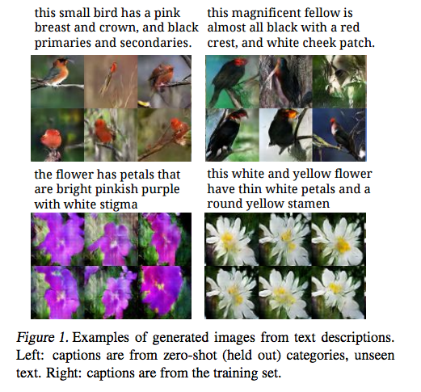
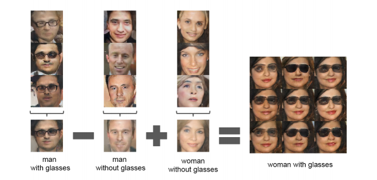

# More architectures

Why doesn't this guy need an encoder?

# Pretty pics

Why does the VAE+GAN seem to do better?

# Resources

* [GAN](https://arxiv.org/abs/1406.2661)
* [Adversarial AE](https://arxiv.org/abs/1511.05644)
* [SRGAN](https://arxiv.org/pdf/1609.04802.pdf)
* [Sampling from genertive models](https://arxiv.org/pdf/1609.04468.pdf)
* [EBGAN](https://arxiv.org/abs/1609.03126)
* [GMMN](https://arxiv.org/abs/1502.02761)
* [Text to image](https://arxiv.org/abs/1605.05396)
* [AEGAN](https://arxiv.org/abs/1512.09300)
* [OpenAI](https://openai.com/blog/generative-models/)
* [Otoro](http://blog.otoro.net/2016/04/01/generating-large-images-from-latent-vectors/)